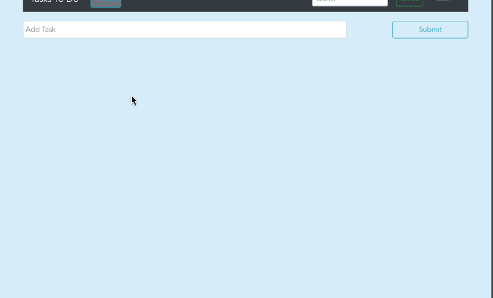

# VueJS Todo App
## About the Author
Name: Samira Mc Queen
[LinkedIn](https://www.linkedin.com/in/samira-mc-queen-1882431a7/)

Free Spririted Caribbean Woman.
Software Developer and aspiring Game Developer

### Project 

## Experience with Project
- This was my first project using Vuejs. It was a great first attempt and since then i have learned new concepts and methods.
- Bootstrap Vue was used for styling whihc was an itriduction to having Bootstrap in Vuejs framework.

## Project setup
Once the project is downloaded locally on your device do the following:
`
npm install
`

If there are dependencies that need updating or you want to check:
`
npm outdated
`

If there are outdated dependencies:
`
npm updated
`

To check and update packages in package.json:
`
npx npm-check-updates -u
`

### Compiles and hot-reloads for development
`
npm run start
`

### Compiles and minifies for production
`
npm run build
`

### Lints and fixes files
`
npm run lint
`
